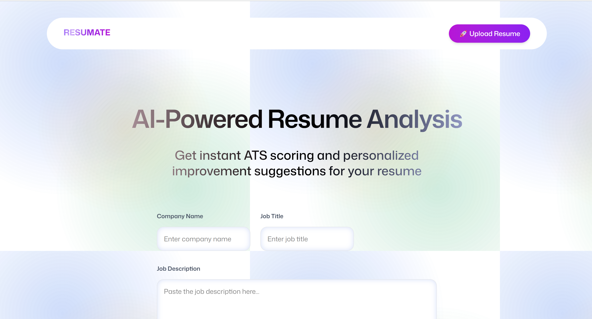

# ✨ ResuMate – AI-Powered Resume Analyzer

ResuMate is an **AI-powered Resume Analyzer** built with React, React Router, and Puter.js.  
It allows users to seamlessly upload resumes, get **ATS scores**, highlight correct and incorrect sections, and receive actionable improvement suggestions.

---

## ⚙️ Tech Stack

- React
- React Router v7
- Puter.com & Puter.js
- Tailwind CSS
- TypeScript
- Vite
- Zustand

---

## 🔋 App Features

- **Seamless Authentication** – Users can sign up and log in entirely in the browser using Puter.js.
- **Resume Upload & Storage** – Safely upload and manage all resumes.
- **AI-Powered Resume Analysis** – Automatically evaluate resumes and provide ATS scores.
- **Correct & Incorrect Resume Sections** – Highlights strengths and areas to improve.
- **Improvement Suggestions** – Personalized tips to enhance resume quality.
- **Resume Summary & Recent Analysis** – Quick overview on the home page.
- **Responsive & Modern UI** – Works on all devices with reusable, maintainable components.

---

## 📸 Screenshots

### Home Page



### Resume Input / Upload


### Analysis Result


### Demo of Working App

## 

## 📦 Installation

```bash
# Clone the repo
git clone https://github.com/your-username/ResuMate.git
cd ResuMate

# Install dependencies
npm install

# Run development server
npm run dev
```
